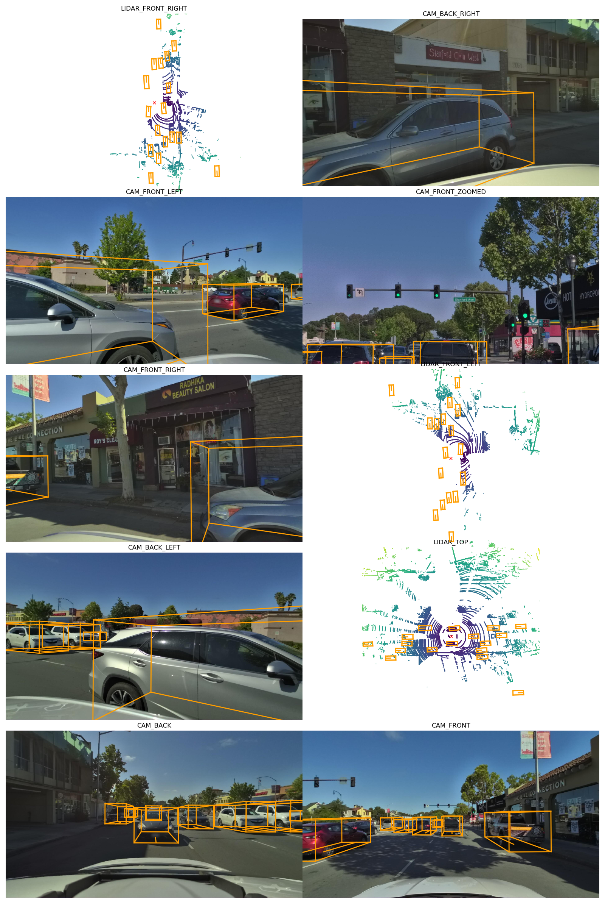
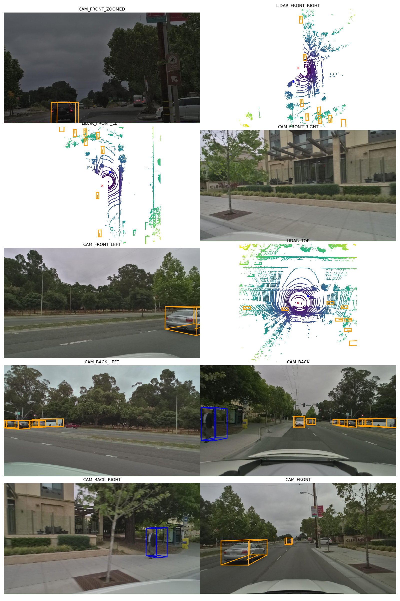
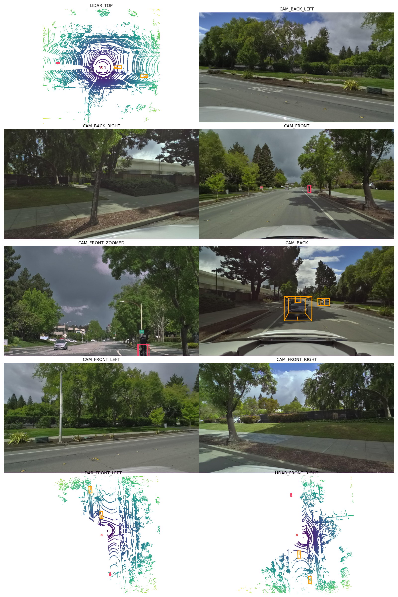

# Lyft 3D Object Detection for Autonomous Vehicles
EC601 Project

## Requirements
* Python >= 3.7
* PyTorch >= 1.0
* CUDA 10 and cudnn 7
The build processes have only be tested on Ubuntu 18.04 and 19.10

**Don't use the official version of NuScenes-Devkit, SECOND and Lyft_Dataset_SDK, our developments are based on the modified version of those repos. Use the packages in this repo.** (Efforts are made in fixing and adding feature to those tool-kits as well.)

## Clone the repository
```bash
git clone git@github.com:YUHZ-ACA/Lyft-3D-Object-Detection.git --recursive
```

>We are using different fork and submodules for developing. Check out fork `YUHZ-ACA/Lyft-3D-Object-Detection` and all the sub-modules for detail. 

## Build and Install
Before training and evaluation, we have to build and install some binaries first.
### spconv
Following the instruction in [spconv](https://github.com/traveller59/spconv):
1. `git clone https://github.com/traveller59/spconv --recursive`
2. install `libboost`: by package manager (Ubuntu package name `libboost-all-dev`) or download from official site then put headers into `spconv/include`
3. make sure `cmake` >= 3.13.2 and the executable in `PATH`
4. navigate into `spconv` directory, then run `python setup.py bdist_wheel`
5. `cd ./dist`, then install the wheels by `pip install [WHEELS_NAME]` or `pip3 install [WHEELS_NAME]`

#### Common Build Problems and Possible Solutions
1. CUDA not found

Ensure CUDA is installed with proper nvidia graphics driver. Ensure that cudnn has been installed correctly.

2. `/usr/local/cuda/lib64/xxx.so` is required by xxx file

If your CUDA installation is not placed in `/usr/local`, e.g. directly `apt install nvidia-cuda-toolkit`, please figure out the directory of `bin` and `lib64`, and soft link the installation directory to target directory (you can use `sudo ln -s [LINK_NAME]`).

If you don't have the permission to use sudo (e.g. on a computing cluster). You can try to fix the problem by downloading a copy of `PyTorch` and modify the CMake File of caffe2 building. There are some hardcoded path of CUDA libs. Modifing those lines and rebuild wheels may solve the problem.

#### SCC Build
Please refer to `/projectnb/ece601/lyft` directory. The spconv binary in that directory is complied on SCC with particular version of python3, glibc and CUDA. The config of modules: 
```
module load python3/3.6.5
module load cuda/10.1
module load pytorch/1.3
module load gcc/7.4.0
module load boost
module load cmake
```
In `scripts` directory, there are also some scripts to run the training on SCC with GPU access.

There are pre-built binaraies of spconv. The directory name means the type of GPU. You can check the GPU name of your node then install the pre-built wheels


### SECOND
1. Install all dependencies (for `conda` user)
```bash
conda install scikit-image scipy numba pillow matplotlib
pip install fire tensorboardX protobuf opencv-python lyft_dataset_sdk
```

2. Install SECOND (for `conda` user)
At top level of SECOND, use
```bash
conda develop .
```

### NUSCENES-DEVKIT
Using the `nuscenes-devkit` in this repo, and add it to `PYTHONPATH` (or `conda develop .`)

## Train and Evaluation

### Data Preparation
Download Lyft Level 5 Dataset. and rename the directory in following format:
```
├── test
│   ├── images
│   ├── lidar
│   ├── maps
│   └── v1.0-test
└── train
    ├── images
    ├── lidar
    ├── maps
    └── v1.0-trainval
```

Then use 
```
python second.pytorch/second/create_data.py nuscenes_data_prep --data_root=NUSCENES_TRAINVAL_DATASET_ROOT --version="v1.0-trainval" --max_sweeps=10 --dataset_name="NuScenesDataset"
```
to generate database

Finally, modify config files
```
train_input_reader: {
  ...
  database_sampler {
    database_info_path: "/path/to/dataset_dbinfos_train.pkl"
    ...
  }
  dataset: {
    dataset_class_name: "DATASET_NAME"
    kitti_info_path: "/path/to/dataset_infos_train.pkl"
    kitti_root_path: "DATASET_ROOT"
  }
}
...
eval_input_reader: {
  ...
  dataset: {
    dataset_class_name: "DATASET_NAME"
    kitti_info_path: "/path/to/dataset_infos_val.pkl"
    kitti_root_path: "DATASET_ROOT"
  }
}
```

### Train
```
python ./pytorch/train.py train --config_path=./configs/car.fhd.config --model_dir=/path/to/model_dir -resume
```

### Eval
Save the result:
```
python ./pytorch/train.py evaluate --config_path=./configs/car.fhd.config --model_dir=/path/to/model_dir --measure_time=True --batch_size=1
```
using functions in `./scripts/eval.py` to get Lyft mAP evaluations.

## Pre-Trained Model
Pre-trained model [here](https://drive.google.com/open?id=1aN6Trusc-4_ozqFR72YZw1x_J41NXkM5https://drive.google.com/drive/u/1/folders/1aN6Trusc-4_ozqFR72YZw1x_J41NXkM5)

You can use this to run the evaluations or resume training process to obtain better result. Note that, the data preparation steps are required to evaluate the dataset.

## Result
Check [`results`](./results)

## Prediction Visualization

Use the Python scripts `./scripts/visualize_result.py` to visualize the prediction result. Don't forget to modify the path of prediction results and Lyft Dataset.

### Modified Lyft Datset SDK
In order to visualize the result, please use our own version of `lyft_dataset_sdk` which add support to draw customize box in image and point cloud.

Here are some sample visualization of our prediction. Check out this [link](https://drive.google.com/open?id=1Dt1vNy0v5Ug6XprxbV3tfvJUO7QTagG8) for more visualizations.

* Sample 1


* Sample 2


* Sample 3


## Misc

There are some other helper script in directory `./scripts` that might be helpful.

## License
MIT


 
